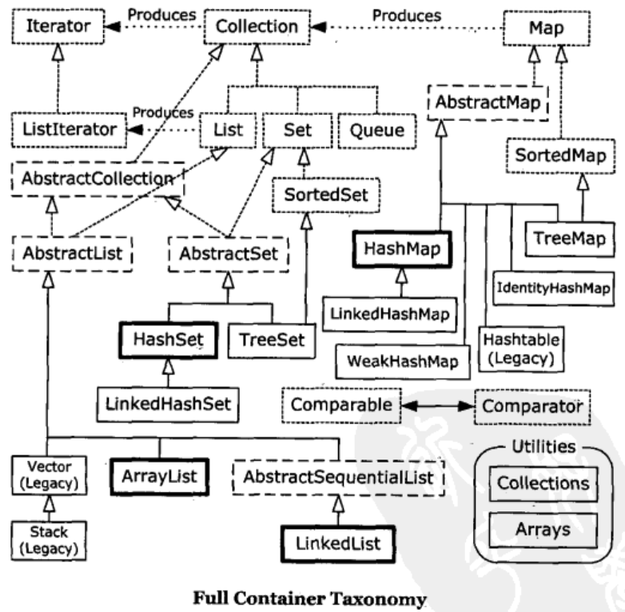

# Containers in Depth #

[Full container taxonomy](#)

[Filling containers](#)

[Collection functionality](#)

[Optional operations](#)

[List functionality](#)

[Sets and storage order](#)

[Queues](#)

[Understanding Maps](#)

[Hashing and hash codes](#)

[Choosing an implementation](#)

[Utilities](#)

[Holding references](#)

[Java 1.0/1.1 containers](#)

## Full container taxonomy ##

Java SE5新添加的：

- Queue接口及其实现PriorityQueue和各种风格BlockingQueue
- ConcurrentMap接口及其实现ConcurrentHashMap
- CopyOnWriteArrayList、CopyOnWriteArraySet用于并发
- EnumSet、EnumMap

## Filling containers ##

Collections.fill()只能针对List，且**复制单个对象的引用**

Collections.nCopies()类似

[FillingLists](FillingLists.java)

	Object.toString() <=> getClass().getName() + '@' + Integer.toHexString(hashCode())

### 一种Generator解决方案 ###

为了更加容易地创建数据

[CollectionData](../util/CollectionData.java) **适配器Adapter**设计模式例子

[CollectionDataTest](CollectionDataTest.java)CollectionData用例

LinkedHashSet维护的是保持了插入顺序的链接列表

[CollectionDataGeneration](CollectionDataGeneration.java)

### Map生成器 ###

[Pair](../util/Pair.java)

[MapData](../util/MapData.java)

[MapDataTest](MapDataTest.java)

### 使用Abstract类 ###

#### AbstractMap ####

Flyweight 享元模式，蝇量模式

You use a **flyweight** when the ordinary solution requires too many objects, or when producing normal objects takes up too much space.

The **Flyweight** pattern externalizes使具体化 part of the object so that, instead of everything in the object being contained within the object, some or all of the object is looked up in a more efficient external table (or produced through some other calculation that saves space). 

为了创建只读Map，可继承AbstractMap并实现entrySet()。

为了创建只读Set，可继承AbstractSet并实现iterator()和size()

[Countries](../util/Countries.java)

[CountingMapData](../util/CountingMapData.java)

#### AbstractList ####

[CountingIntegerList](../util/CountingIntegerList.java)

## Collection functionality ##

method|description
---|---
boolean add(T)|Ensures that the container holds the argument which is of generic type T.Returns false if it doesn’t add the argument. (This is an "optional" method, described in the next section.)
boolean addAll(Collection<? extends T>)|Adds all the elements in the argument.Returns true if any elements were added. ("Optional.")
void clear( )|Removes all the elements in the container. ("Optional.")
boolean contains (T)|true if the container holds the argument which is of generic type T.
Boolean containsAll(Collection<?>)|true if the container holds all the elements in the argument.
boolean isEmpty( )|true if the container has no elements.
Iterator<T> iterator( )|Returns an Iterator<T> that you can use to move through the elements in the container.
Boolean remove(Object)|If the argument is in the container, one instance of that element is removed.Returns true if a removal occurred.("Optional")
boolean removeAll(Collection<?>)|Removes all the elements that are contained in the argument. Returns true if any removals occurred. ("Optional.")
Boolean retainAll(Collection<?>)|Retains only elements that are contained in the argument (an "intersection交集," from set theory). Returns true if any changes occurred. ("Optional.")
int size( )|Returns the number of elements in the container.
Object[] toArray( )|Returns an array containing all the elements in the container.
<T>T[] toArray(T[] a)|Returns an array containing all the elements in the container. The runtime type of the result is that of the argument array a rather than plain Object.

使用ArrayList，以说明各种Collection子类的“最基本的共同的特性”。

[CollectionMethods](CollectionMethods.java)

## Optional operations ##

执行各种不同的添加和移除的方法在Collection接口中都是**可选操作**。这意味着实现类并不需要为这些方法提供功能定义。

**为什么将方法定义为可选的呢？**因为这可防止在设计中出现接口爆炸的情况。

容器类库中的其他设计看起来总是为了描述每个主题的各种变体，而最终患上了令人困惑的接口过剩症。

甚至这么做仍不能捕捉接口的各种特例，因为总是有人会发明新的接口。

“未获支持的操作”这种方式可实现Java容器类库的一个重要目标：容器易学易用。未获支持的操作是一种特例，可以延迟到需要时再实现。

为了让这种方式工作：

1. UnsupportedOperationException必须是一种罕见事件。即，对于多数类来说，所有操作都应该可以工作，只有在特例中才会有未获支持的操作。在Java容器类库中确实如此，因为你在99%时间内使用的容器类，如ArrayList，LinkedList，HashSet，HashMap以及其他的具体实现，都支持所有的操作。这种设计留下一个“后门”，如果想创建新的Collection，但是没有为Collection接口总的所有方法都提供有意义的意义，那么它仍旧适合现在的类库。
2. 若一操作是未获支持的，那么再实现接口的时候可能就会导致UnsupportOperationException异常，而不是将产品程序交个客户以后才出现此异常，这种情况是有道理的。毕竟，它表示编程上有错误：使用不正确的接口实现。

### 未获支持的操作 ###

Arrays.asList()

Collections.unmodifiableList()

通过[Unsupported](Unsupported.java)打印出会抛出UnsupportedOperationException的方法。

## List functionality ##

ArrayList、LinkedList

[Lists](Lists.java)

## Sets and storage order ##

Class|Description
---|---
Set (interface)|Each element that you add to the Set must be unique; otherwise, the Set doesn’t add the duplicate element. Elements added to a Set must at least define equals( ) to establish object uniqueness. Set has exactly the same interface as Collection. The Set interface does not guarantee that it will maintain its elements in any particular order.
HashSet|For Sets where fast lookup time is important.**Elements must also define hashCode()**.
TreeSet|An ordered Set backed by a tree. This way, you can extract an ordered sequence from a Set. **Elements must also implement the Comparable interface**.
LinkedHashSet|Has the lookup speed of a HashSet, but internally maintains the order in which you add the elements (the insertion order) using a linked list. Thus, when you iterate through the Set, the results appear in insertion order. **Elements must also define hashCode()**. 

**对于良好的编程风格而言，覆盖equals()同时覆盖hashCode()**

[TypesForSets](TypesForSets.java)

### SortedSet ###

SortedSet的元素可以保证处于排序状态

SortedSet提供的附加接口

Method|Description
---|---
Comparator comparator( )|Produces the Comparator used for this Set, or null for natural ordering.
Object first( )|Produces the lowest element.
Object last( )|Produces the highest element.
SortedSet subSet(fromElement, toElement)|Produces a view of this Set with elements from fromElement, inclusive, to toElement, exclusive.
SortedSet headSet(toElement)|Produces a view of this Set with elements less than toElement.
SortedSet tailSet(fromElement)|Produces a view of this Set with elements greater than or equal to fromElement. 

[SortedSetDemo](SortedSetDemo.java)

## Queue ##

[QueueBehavior](QueueBehavior.java)

### 优先级队列 ###

[ToDoList](ToDoList.java)

### 双向队列 ###

[Deque](Deque.java)

[DequeTest](DequeTest.java)

## Understanding Maps ##

**映射表**（也称为**关联数组**）的基本思想是它维护的是键-值对关联，因此你可以使用键查找值。

[AssociativeArray](AssociativeArray.java) 一个简单的关联数组实现。

### 性能 ###

Map|Description
---|---
HashMap|Implementation based on a hash table. (Use this class instead of **Hashtable**.) Provides constant-time performance for inserting and locating pairs. Performance can be adjusted via constructors that allow you to set the capacity and load factor of the hash table.
LinkedHashMap|Like a **HashMap**, but when you iterate through it, you get the pairs in insertion order, or in least-recently-used (LRU) order. Only slightly slower than a **HashMap**, except when iterating, where it is faster due to the linked list used to maintain the internal ordering.
TreeMap|Implementation based on a red-black tree. When you view the keys or the pairs, they will be in sorted order (determined by **Comparable** or **Comparator**). The point of a TreeMap is that you get the results in sorted order. TreeMap is the only Map with the subMap( ) method, which allows you to return a portion of the tree.
WeakHashMap|A map of weak keys that allow objects referred to by the map to be released; designed to solve certain types of problems. If no references to a particular key are held outside the map, that key may be garbage collected.
ConcurrentHashMap|A thread-safe **Map** which does not involve synchronization locking. This is discussed in the Concurrency chapter.
IdentityHashMap|A hash map that uses == instead of **equals()** to compare keys. Only for solving special types of problems; not for general use. 

[Maps](Maps.java)

### SortedMap ###

SortedMap提供的接口

Method|Description
---|---
Comparator comparator( )|Produces the comparator used for this Map, or null for natural ordering.
T firstKey( )|Produces the lowest key.
T lastKey( )|Produces the highest key.
SortedMap subMap(fromKey, toKey)|Produces a view of this Map with keys from fromKey, inclusive, to toKey, exclusive. SortedMap headMap(toKey): Produces a view of this Map with keys less than toKey.
SortedMap tailMap(fromKey)|Produces a view of this Map with keys greater than or equal to fromKey. 

[SortedMapDemo](SortedMapDemo.java)

### LinkedHashMap ###

特殊用法：

可在构造器中设定LinkedHashMap，使之采用基于访问的**最近最少使用**(LRU)算法，于是没有被访问过的元素就会出现在队列的前面。

[LinkedHashMapDemo](LinkedHashMapDemo.java)

## Hashing and hash codes ##

[SpringDetector](SpringDetector.java)没有覆盖hashCode()和equals()，HashMap并没有按预期工作

未被覆盖Object.equals()的源码

    public boolean equals(Object obj) {
        return (this == obj);
    }

默认的是 **比较是否引用对象的地址**。

**覆盖hashCode()同时也要覆盖equals()**

正确的equals()方法必须满足下列5个条件：

1. Reflexive自反性: For any **x**, **x.equals(x)** should return **true**.
2. Symmetric对称性: For any **x** and **y**, **x.equals(y)** should return **true** if and only if **y.equals(x)** returns **true**.
3. Transitive传递性: For any **x**, **y**, and **z**, if **x.equals(y)** returns true and **y.equals(z)** returns true, then **x.equals(z)** should return true.
4. Consistent一致性: For any **x** and **y**, multiple invocations of **x.equals(y)** consistently return **true** or consistently return **false**, provided no information used in equals comparisons on the object is modified.
5. 否空性，For any non-**null** **x**, **x.equals(null)** should return false. 

[SpringDetector2](SpringDetector2.java)覆盖hashCode()和equals()后，HashMap能按预期工作

当在HashSet中使用自己的类作为键时，必须注意这个问题。

### 理解hashCode() ###

[SlowMap](SlowMap.java) 使用ArrayList实现Map

[MapEntry](MapEntry.java) 保存键值

### 为速度而散列 ###

上例使用简单的线性查询，而**线性查询是最慢的查询方式**

散列使用数组，使用它来表示键的信息（不是键的本身）

数组并不保存键本身。而是通过键对象生成一个数字(散列码)，将其作为数组的下标。散列码由Object.hashCode()方法散列函数生成。

为解决数组容量被固定的问题，不同的键可产生相同的下标。也就是说，可能会有**冲突**。

于是查询一个值的过程**首先**计算散列码，然后使用散列码查询数组。冲突由**外部链接**处理：数组并不直接保存值，而是保存值的list。

然后对list中的值使用equals()方法进行线性查询。

这部分查询自然会比较慢，但是如果散列函数好的话，数组的每个位置就只有较少的值。因此，不是查询整个list，而是快速地跳到数组的某个位置，只对很少的元素进行比较。这便是HashMap会如此快的原因。

[SimpleHashMap](SimpleHashMap.java)

散列表中的“槽位”slot通常称为桶位“bucket”

### 覆盖hashCode() ###

无论何时，对同一个对象调用hashCode()都调用hashCode()都应该生成同样的值。

不应该使hashCode()依赖于具有**唯一性**的对象信息，尤其是使用**this**的值，这只能产生很糟糕的hashCode()

[StringHashCode](StringHashCode.java)String的hashCode明显基于String的内容。

hashCode()必须基于对象的内容生成散列码。

hashCode()和equals()，必须能够完全确定对象的身份

1. 均匀性
2. 高效性
3. 一致性

---

**Jushua Bloch教你怎样写出一份像样的hashCode()给出了基本的指导**

- 给**int**变量result赋予某个非零值常量，例如17
- 为对象内每个有意义的域**f**(即每个可以做equals()操作的域)计算出一个**int**散列码c：

Field type|Calculation
---|---
boolean|c = ( f ? 0 : 1)
byte, char, short, or int|c = (int)f
long|c = (int)(f ^ (f>>>32))
float|c = Float.floatToIntBits(f);
double|long l = Double.doubleToLongBits(f); c = (int)(1 ^ (l>>>32))
Object, where equals( ) calls equals( ) for this field|c = f.hashCode( )
Array|Apply above rules to each element

- 合并计算得到的散列值
result = 37 * result + c
- 返回result
- 检查hashCode()最后生成的结果，确保相同的对象有相同的散列表。

[CountedString](CountedString.java) hashCode编写实例

[Individual](../typeinformation/pets/Individual.java) hashCode编写另一实例

[IndividualTest](IndividualTest.java)

## 选择接口的不同的实现 ##

ArrayList底层由数组支持，LinkedList是由双向链表实现。

### 性能测试框架 ###

[Test](Test.java)

[TestParam](TestParam.java)

[Tester](Tester.java)

### 对List的选择 ###

[ListPerformance](ListPerformance.java)

ArrayList**随机访问**比LinkedList比快，但是在**插入**和**删除**方面就稍逊一色。

Vector是古董，现在就不要用了

固定数量元素就用**数组**或**Arrays.asList()**

Queue先进先出。

CopyOnWriteArrayList专门用并发编程。

### 微基准测试 ###

Microbenchmarking

**微基准测试**，你务必小心，不能做太多的假设，并且要将你的测试窄化，以使得它们尽可能地只在感兴趣的事项上花费精力。

还必须仔细确保你的测试运行足够长的时间，以产生有意义的数据

### 对Set的选择 ###

[SetPerformance](SetPerformance.java)

HashSet性能基本上总是比TreeSet好，特别是**添加**和**查询**

TreeSet存在的唯一原因是它可以维持元素的排序状态，因此，迭代比HashSet的快

### 对Map的选择 ###

[MapPerformance](MapPerformance.java)

PS.上述的测试在本人机子上的**运行结果**与书本上的相比，有明显出入。

**HashMap的性能因子**

- **Capacity**: The number of buckets in the table.
- **Initial capacity**: The number of buckets when the table is created. HashMap and HashSet have constructors that allow you to specify the initial capacity.
- **Size**: The number of entries currently in the table.
- **Load factor负载因子**: Size/capacity. A load factor of o is an empty table, 0.5 is a half-full table, etc. A lightly loaded table will have few collisions and so is optimal for insertions and lookups (but will slow down the process of traversing with an iterator).
HashMap and HashSet have constructors that allow you to specify the load factor, which means that when this load factor is reached, the container will automatically increase the capacity (the number of buckets) by roughly doubling it and will redistribute the existing objects into the new set of buckets (this is called rehashing). 

**The default load factor** used by HashMap is **0.75** (it doesn’t rehash until the table is threefourths full). This seems to be a good trade-off between time and space costs. A higher load factor decreases the space required by the table but increases the lookup cost, which is important because lookup is what you do most of the time (including both get( ) and put()). 

## 实用方法 ##

java.util.Collections类内部的静态方法。

Method|Description
---|---
**checkedCollection**(Collection&lt;T>, Class&lt;T> type) **checkedList**(List&lt;T>, Class&lt;T> type) **checkedMap**(Map&lt;K,V>,Class &lt;K> keyType,Class &lt;V> valueType) **checkedSet**(Set&lt;T>,Class&lt;T> type) **checkedSortedMap**(SortedMap&lt;K,V>,Class&lt;K> keyType,Class &lt;V> valueType) **checkedSortedSet**(SortedSet&lt;T>,Class&lt;T> type)|Produces a dynamically type-safe view of a Collection, or a specific subtype of Collection. Use this when it’s not possible to use the statically checked version. These were shown in the Generics chapter under the heading "Dynamic type safety."
**max**(Collection) **min**(Collection)|Produces the maximum or minimum element in the argument using the natural comparison method of the objects in theCollection.
**max**(Collection, Comparator) **min**(Collection, Comparator)|Produces the maximum or minimum element in the Collection using theComparator.
**indexOfSubList**(List source, List target)|Produces starting index of the first place where target appears inside source, or -1 if none occurs.
**lastIndexOfSubList**(List source, List target)|Produces starting index of the last place where target appears inside source, or -1 if none occurs.
**replaceAll**(List&lt;T>,T oldVal, T newVal)|Replaces all oldVal with newVal.
**reverse**(List)|Reverses all the elements in place.
**reverseOrder**( ) **reverseOrder**(Comparator&lt;T>)|Returns a Comparator that reverses the natural ordering of a collection of objects that implementComparable&lt;T>. The second version reverses the order of the supplied Comparator.
**rotate**(List, int distance)|Moves all elements forward by distance, taking the ones off the end and placing them at the beginning.
**shuffle**(List) **shuffle**(List, Random)|Randomly permutes the specified list. The first form provides its own randomization source, or you may provide your own with the second form.
**sort**(List&lt;T>) **sort**(List&lt;T>,Comparator&lt;? super T> c)|Sorts the List&lt;T> using its natural ordering. The second form allows you to provide a Comparator for sorting.
**copy**(List&lt;? super T> dest, List&lt;? extends T> src)|Copies elements from src to dest.
**swap**(List, int i, int j)|Swaps elements at locations i and j in the List. Probably faster than what you’d write by hand.
**fill**(List&lt;? super T>, T x)|Replaces all the elements of list with x.
**nCopies**(int n, T x)|Returns an immutable List&lt;T> of size n whose references all point to x.
**disjoint**(Collection, Collection)|Returns true if the two collections have no elements in common.
**frequency**(Collection, Object x)|Returns the number of elements in the Collection equal to x.
**emptyList**() **emptyMap**() **emptySet**()|Returns an immutable empty List,Map, or Set. These are generic, so the resulting Collection will be parameterized to the desired type.
**singleton**(T x) **singletonList**(T x) **singletonMap**(K key, V value)|Produces an immutable Set&lt;T>,List&lt;T>, or Map&lt;K,V> containing a single entry based on the given argument(s).
**list**(Enumeration&lt;T> e)|Produces an ArrayList&lt;T> containing the elements in the order in which they are returned by the (old-style) Enumeration (predecessor to the Iterator). For converting from legacy code.
**enumeration**(Collection&lt;T>)|Produces an old-style Enumeration&lt;T> for the argument. 

[Utilities](Utilities.java)

### List的排序和查询 ###

[ListSortSearch](ListSortSearch.java)

### 设定Collection或Map为不可修改 ###

unmodifiableCollection/unmodifiableList/unmodifiableSet/unmodifiableMap等

[ReadOnly](ReadOnly.java)

### Collection或Map的同步控制 ###

[Synchronization](Synchronization.java)

**快速报错**

Java容器有一种保护机制，能够防止多个进程同时修改同一个容器的内容。

若迭代遍历某个容器的过程中，另一个进程介入其中，并且插入、删除或修改此容器内的某个对象，那么就会出现问题；也许迭代过程已经处理过容器中的该元素，也许还未处理，也许带调用size()之后容器的尺寸收缩了——还有许多灾难情景。

Java容器类类库采用**快速报错fail-fast**机制。它会探查容器上的任何除了你的进程所进行的操作以外的所有变化，一旦它发现其它进程修改了容器，就会立刻抛出**ConcurrentModificationException**

Concurrent同时发生的
Modification修改

[FailFast](FailFast.java) 会抛出ConcurrentModificationException的示例

ConcurrentHashMap/CopyOnWriteArrayList/CopyOnWriteArraySet可避免ConcurrentModificationException

## Holding references ##

java.lang.ref的一组类

Reference派生的子类
- SoftReference
- WeakReference
- PhantomReference

当垃圾回收器Garbage Collector GC正在考察对象只能通过某种Reference对象才“可获得”时，上述这些不同Reference派生类为GC停供了不同级别的间接性指示。

对象是**可获得**reachable，是指此对象可在程序中的某处找到。这意味着你在栈中有一个普通的引用，而它正指向此对象；

也可能是你的引用指向某个对象，而那个对象含有另一个引用指向正在讨论的对象；

也可能有更多的中间链接。

若有个对象是“可获得的”，GC就不能释放它，因为它仍然为你的程序所有。

若有个对象不是“可获得的”，那么你的程序将无法使用到它，所以将其回收是安全的。

**如果想继续持有某个对象的引用，希望以后还能够访问到该对象，但是也希望能够允许GC释放它，这时就应该使用Reference对象。**这样，你可以继续使用该对象，而在内存消耗殆尽时候又允许释放该对象。

以Reference对象作为你和普通引用之间的媒介（代理），另外，一定不能有普通的引用指向那个对象，这样就能达到上述目的。（**普通引用指没有经Reference对象包装过的引用**）。若GC发现某个对象通过普通引用是可获得的，该对象就不会被释放。

**SoftReference**、**WeakReference**和**PhantomReference**由强到弱排列，对应不同级别的“可获得性”。

- SoftReference 用以实现内存敏感的高速缓存
- WeakReference 为实现“规范映射canonicalizing mappings”而设计的，它不妨碍垃圾回收器回收映射的“键”（或“值”）。“规范映射”中对象的实例可以在程序的多处被同时使用，以节省存储空间。
- PhantomReference 用以调度回收前的清理工作，它比Java终止机制更灵活

**SoftReference**、**WeakReference**时，可以选择是否要将它们放入**ReferenceQueue**(“回收前清理工作”的工具)。**PhantomReference**只能依赖于**ReferenceQueue**。

[References](References.java)

### WeakHashMap ###

它被用来保存WeakReference。

它使得规范映射更易于使用。

在这种映射中，每个值只保存一份实例以节省存储空间。

当程序需要那个“值”的时候，便于映射中查询现有的对象，然后使用它（而不是重新再创建）。

映射可将值作为其初始化中的一部分，不过通常是在需要的时候才生成“值”。

这是一种节约存储空间的技术，因为WeakHashMap允许垃圾回收器自动清理键和值，所以它显得十分便利。对于WeakHashMap添加键和值的操作，则没有什么特殊要求。映射会自动使用WeakReference包装它们。

允许清理元素的触发条件是，不再需要此键：

[CanonicalMapping](CanonicalMapping.java)

## Java 1.0/1.1的容器 ##

古董容器，了解一下，现在就要再用了。

### Vector和Enumeration ###

Vector现已被Collection和List代替

Enumeration 现已被iterator代替

[Enumerations](Enumerations.java)

### HashTable ###

HashTable与HashMap类似

### Stack ###

Stack现由LinkedList代替

[Stacks](Stacks.java)

### BitSet ###

若想高效率存储大量“开/关”信息，Bit是很好的选择。不过它的效率仅是对空间而言；若需高效的访问时间，BitSet比本地数组稍慢一些。

[Bits](Bits.java)

若拥有一个可以命名固定的标志集合，那么EnumSet与BitSet相比，通常是一种更好的选择。

