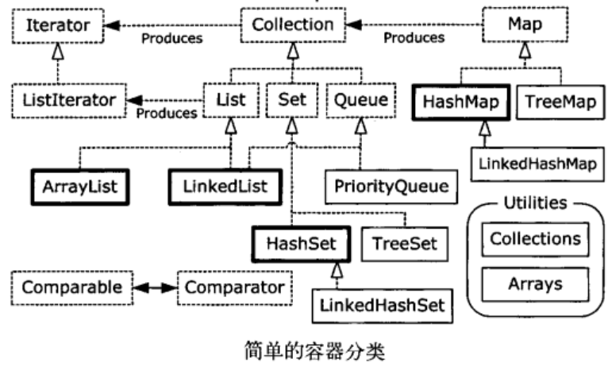

# Holding Your Objects #

[Generics and type-safe containers](#)

[Basic concepts](#)

[Adding groups of elements](#)

[Printing containers](#)

[List](#)

[Iterator](#)

[LinkedList](#)

[Stack](#)

[Set](#)

[Map](#)

[Queue](#)

[Collection vs Iterator](#)

[Foreach and iterators](#)

[Summary](#)

java.util库提供完整的容器类。

基本的类型是List、Queue、Set、Map。

这些对象类型也称为集合类，但由于Java的类库中使用Collection这词来指代该类库的一个特殊子集，所以使用了范围更广的属于“容器Container”称呼它们。

## Generics and type-safe containers ##

在JavaSE5之前从容器中取出必须要强制转换。

[ApplesAndOrangesWithoutGenerics](ApplesAndOrangesWithoutGenerics.java)

JavaSE5后使用泛型，尖括号括起来的是**类型参数**，它指定了这个容器实例可以保存的类型。

使用泛型，可以在编译期防止将错误类型的对象放置到容器中。

[ApplesAndOrangesWithGenerics](ApplesAndOrangesWithGenerics.java)

此外，类型转换也不再是必需的。

**向上转型**（继承关系）可以像作用于其他类型一样作用于泛型。

[GenericsAndUpcasting](GenericsAndUpcasting.java)

Object默认的toString()方法产生的，该方法将打印类名，随后是**对象的散列码**的无符号的十六进制表示（hashCode()方法产生的）。

## Basic concepts ##

Java容器类类库的用途是“保存对象”:

1. **Collection** 一个独立元素的序列。
	- List必须按照插入的顺序保存元素
	- Set不能有重复的元素
	- Queue按照排队规则确定对象产生的顺序
2. **Map** “键值对”对象。ArrayList允许你使用数字来查找值，因此在某种意义上讲，它将**数字**与**对象**关联在一起。 **映射表**允许使用另一个对象来查找某个对象，它也被称为 **关联数组** 或 **字典**

Collection接口概括了序列的概念

[SimpleCollection](SimpleCollection.java)

## Adding groups of elements ##

Collections.addAll()接受一个Collection对象，以及一个数组或是一个用逗号分割的列表，将元素添加到Collection

[AddingGroups](AddingGroups.java)

Arrays.asList底层是数组，不能调整尺寸。调用add()或delete()，会得出  java.lang.UnsupportedOperationException

[AsListInference](AsListInference.java)

可以在Arrays.asList()中间插入一条“线索”，以告诉编译器对于由Arrays.asList()产生的List类型，实际的目标类型应该是什么。这称为**显式类型参数说明**

## Printing containers ##

使用Arrays.toString()来产生数组的可打印表示，但是打印容器无需任何帮助。

[PrintingContainers](PrintingContainers.java)

Collection打印出来的内容用[]括住。

Map的则用{}括住。

## List ##

- ArrayList，擅长随机访问元素，但是List的插入和移除元素较慢。
- LinkedList，擅长List的插入和移除元素，提供了优化的顺序访问，当随机访问相对比较慢，但是它的特性集较ArrayList更大。

[ListFeatures](ListFeatures.java)

List一些方法示例

## Iterator ##

它的工作是遍历并选择序列中的对象。

Java的Iterator只能单向移动

[SimpleIteration](SimpleIteration.java)

不同容器的迭代
[CrossContainerIteration](CrossContainerIteration.java)

双向迭代器 [ListIteration](ListIteration.java)

## LinkedList ##

它插入和移除元素比ArrayList搞笑，但是随机访问就逊色了

它还可以使其作栈stack/stæk/、队列queue/kju/和双端队列deque/'dek/的

[LinkedListFeatures](LinkedListFeatures.java)

## Stack ##

后进先出last-in, first-out的容器，联想下 枪弹夹

可以用LinkedList作为栈使用。

[Stack](../util/Stack.java)

[StackTest](StackTest.java)

[StackCollision](StackCollision.java)

## Set ##

它不保存重复的元素。

HashSet [SetOfInteger](SetOfInteger.java)

TreeSet [SortedSetOfInteger](SortedSetOfInteger.java)

[SetOperations](SetOperations.java)

[UniqueWords](UniqueWords.java)

[UniqueWordsAlphabetic](UniqueWordsAlphabetic.java)

## Map ##

[Statistics](Statistics.java)

[PetMap](PetMap.java)

[MapOfList](MapOfList.java)

## Queue ##

队列是一个典型的先进先出FIFO的容器。

[QueueDemo](QueueDemo.java)

### PriorityQueue ###

**优先级队列**声明下一个弹出元素是最需要的元素（具有最高的优先级）

[PriorityQueueDemo](PriorityQueueDemo.java)

## Collection and Iterator ##

Collection意味着需要着提供iterator()

[MapOfList](MapOfList.java)

[CollectionSequence](CollectionSequence.java)

[NonCollectionSequence](NonCollectionSequence.java)

## Foreach and iterators ##

[ForEachCollections](ForEachCollections.java)

[IterableClass](IterableClass.java)

[EnvironmentVariables](EnvironmentVariables.java)

[ArrayIsNotIterable](ArrayIsNotIterable.java)

### 适配器方法惯用法 ###

若现有一个Iterable类，你想要添加一种或多种在foreach语句中使用这个类的方法。

例如，假设你希望可以选择以向前的方向 或是 向后的方向迭代一个单词列表。

若直接继承这个类，并覆盖iterator()方法，你只能替换现在的方法，而不能实现选择。

解决之道：**适配器方法**惯用法

[AdapterMethodIdiom](AdapterMethodIdiom.java)

[MultiIterableClass](MultiIterableClass.java)

[ModifyingArraysAsList](ModifyingArraysAsList.java)

## Summary ##

[ContainerMethodDifferences](ContainerMethodDifferences.java)
程序输出也展现了在每个类或接口中所实现的接口

Java provides a number of ways to hold objects:

1. An **array** associates numerical indexes to objects. It holds objects of a known type so that you don’t have to cast the result when you’re looking up an object. It can be multidimensional, and it can hold primitives. However, its size cannot be changed once you create it.

2. A **Collection** holds single elements, and a **Map** holds associated pairs. With Java generics, you specify the type of object to be held in the containers, so you can’t put the wrong type into a container and you don’t have to cast elements when you fetch them out of a container. Both **Collections** and **Maps** automatically resize themselves as you add more elements. A container won’t hold primitives, but autoboxing takes care of translating primitives back and forth to the wrapper types held in the
container.

3. Like an array, a **List** also associates numerical indexes to objects— thus, arrays and Lists are ordered containers.

4. Use an **ArrayList** if you’re doing a lot of random accesses, but a LinkedList if you will be doing a lot of insertions and removals in the middle of the list.

5. The behavior of Queues and stacks is provided via the **LinkedList**.

6. A **Map** is a way to associate not integral values, but objects with other objects. **HashMaps** are designed for rapid access, whereas a **TreeMap** keeps its keys in sorted order, and thus is not as fast as a **HashMap**. A **LinkedHashMap** keeps its elements in insertion order, but provides rapid access with hashing.

7. A **Set** only accepts one of each type of object. **HashSets** provide maximally fast lookups, whereas **TreeSets** keep the elements in sorted order. **LinkedHashSets** keep elements in insertion order.

8. There’s no need to use the legacy classes **Vector**, **Hashtable**, and **Stack** in new code. 

