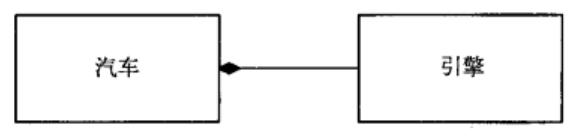
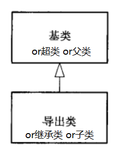
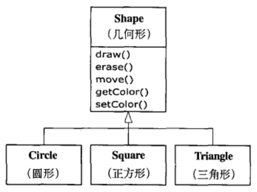
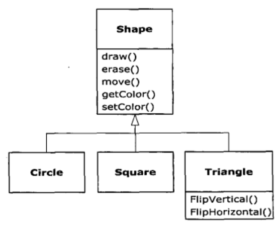
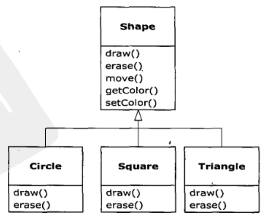
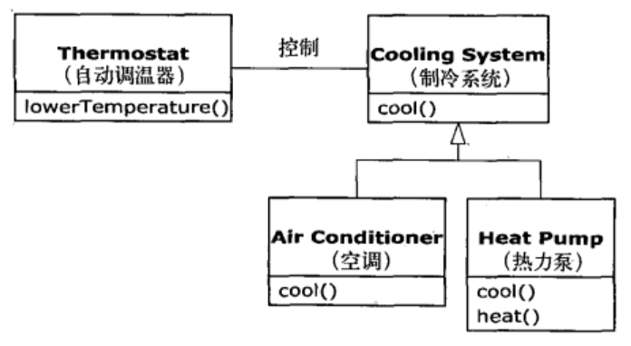
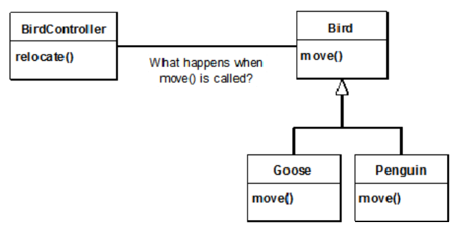
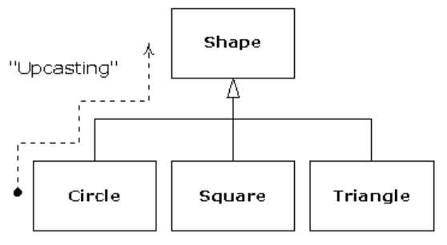

# 对象导论 #

>我们之所以将自然界分解，组织成各种概念，并按其含义分类，主要是因为我们是整个口语交流社会共同遵守的协定的参与者，这个协定以语言的形式固定下来......除非赞成这个协定中规定的有关语言信息的组织和分类，否则我们根本无法交谈——Benjamin Lee Whorf 人类学家，语言学家

## 抽象过程 ##

汇编，C等语言所作的主要抽象仍要求在解决问题时要**基于计算机的结构**，而不是**基于所要解决的问题的结构**来考虑的。

**程序员的作用**——

程序员必须建立起在**机器模型**(位于**解空间**内，这是对问题建模的地方，例如计算机) 和 **实际待解决问题的模型**(位于**问题空间**内，这是存在的地方，例如一项业务)之间的关联。

建立这种映射是费力的，而且这不属于编程语言所固有的功能，这使程序难以编写，并且维护代价高昂，同时也产生了作为副产物的整个**编程行业**

---

面向对象方式将**问题空间**中的元素及其在**解空间**的表示称为**对象**。

这种思想的**实质**是：**程序可以通过添加新类型的对象使自身适用于某个特定的方法**。

当你在阅读描述解决方案的代码的同时，也是在阅读问题的表述。相比以前我们所使用的编程语言，这是一种更灵活，更强有力的**抽象**。

所以，OOP允许根据问题来描述问题，而不是根据运行解决方案的计算机来描述问题。

---

Alay Kay总结5个OOP的基本特性：

1. 万物皆为对象。

2. 程序是对象的集合，它们通过发送消息来告知彼此所要做的。

3. 每个对象都有自己的由其他对象所构成的存储。（**组合**）

4. 每个对象都拥有其类型——每个对象都是某个类class的一个实例instance。

5. 某一特定类型的所有对象都可以接受同样的消息。 （**多态**）

Grady Booch 对 对象提出了一个更加简洁的描述：**对象具有状态、行为和标识**

## 每个对象都有一个接口 ##

面向对象程序设计的挑战之一，就是在**问题空间的元素和解空间的对象之间创建一对一的映射**。

怎样才能获得有用的对象呢？必须有某种方式产生对**对象请求**，使对象完成各种任务，如完成一笔交易、在屏幕上画图、打开开关等等。

每个对象都只能满足某些请求，这些请求由对象的接口interface所定义，决定接口的便是类型。

**接口**确定了对某一特定对象所能发出的**请求**。在程序中必须有满足这些请求的代码。这些代码与隐藏的数据一起构成**实现**。

在类型中，每一个可能的请求都有一个方法与之相关联，当向对象“发送消息”产生请求时，与之相关联的方法就会被调用。

此过程通常被概括为：向某个对象“发送消息”(产生请求)，这个对象便知道此消息的目的，然后执行对应程序代码。

## 每个对象都提供服务 ##

当正在试图开发或理解一个程序设计时，最好的方法之一就是将对象想象为**服务提供者**。程序本身将向用户提供服务，它将通过调用其他对象提供的服务来实现这一目的。**你的目的就是去创建（或者最好是在现有代码库中寻找）能够提供理想的服务来解决问题的一系列对象**。

1. 着手从事这件事的一种方式就是问自己：“**若我可以将问题从表现中抽取出来，那么什么样的对象可以马上解决我的问题**？”

2. 在编程过程当中，哪些对象已经存在，哪些对象不存在，它们看起来是怎样的？它们能够提供哪些服务它们需要哪些对象才能履行它们的义务？如果持续这样做，那么最终你会说“**那个对象看起来很简单，可以做下来写代码了**”，或者说“我肯定那个对象已经存在”。**这是将问题分解为对象集合一种合理的方法**。

将对象看作是服务提供者还有一个附带的好处：有助于提高对象的内聚性。

**高内聚**是软件设计的基本质量要求之一：这意味着一个软件构件（例如一个对象，当然它也有可能是指一个方法或一个对象库）的各个方面“组合”得很好。

**在良好的OOP中，每个对象都可以很好地完成一项任务，但是它并不视图做更多的事**。

## 被隐藏的具体实现 ##

**客户端程序员**的目标是收集各种用来实现快速应用开发的类。

**类创建者**的目标是构建类，这种类只向客户端程序员暴露必需的部分，而隐藏其他部分。

**为什么要这样**？因为如果加以隐藏，那么客户端程序员将不能够访问它，这意味着类创建者可以任意修改被隐藏的部分，而不用担心对其他任何人造成影响。

被隐藏的部分通常代表对象内部脆弱的部分，它们很容易被粗心或不知内情的客户端程序员所毁坏，因此将实现隐藏起来可减少程序Bug，让程序员更应该专注那些他本分工作。

这里就要用到**访问控制**

private/protected/public/package(缺省) **访问指定词access specifier**

## 复用具体实现 ##

复用某个类的方式

1. 直接使用
2. 将某个类置于一个新类（组合）

使用现有的类合成新的类，所以这种概念被称为**组合**(composition)。

若组合是**动态**发生的，那么它通常被称为**聚合**(aggregation)。

组合经常被视为“has-a”(拥有)关系，如“汽车拥有引擎”。

>组合优于继承

## 继承 ##

对象这种观念，十分方便的工具，你可以通过概念将数据和功能**封装**到一起，因此可以**对问题空间的观念给出恰当的表示**，而不用受制于必须使用底层机器语言。这概念用关键字**class**来表示，它们形成了编程语言中的基本单位。

---

**麻烦**：
在创建一个类之后，即使另一个新类与其具有相似的功能，你就得重新创建一个新类。

**希冀**：
若能以现有类为基础，复制它，然后通过添加和修改这个副本来创建新类那就要好多了

**解决**：

继承

---

>There is no such thing as a pair of individuals that are
indiscernible from each other.——Gottfried Wilhelm Leibniz [Link](http://www.earlymoderntexts.com/assets/pdfs/leibniz1715_1.pdf)

>世界上没有两片完全相同的树叶——莱布尼茨

类型不仅仅只是描述了作用于一个对象集合上的约束条件，同时还有与其他类型之间的**关系**。

两个类型可有**相同**的**特性**和**行为**，但其中一类型可能不另一个含有更多特性，并且可以处理更多的消息（或以不同的方式来处理消息**重载**）。

继承使用**基类型**和**派生类型**的概念表示了这种类型之间的相似性。

一个基类类型包含其所有导出类型所共享的特性和行为。

可以创建一个基类型来表示系统中某些对象的核心概念，从基类型中导出其他类型，来表示此核心可以被实现的各种不同方式。

例子：

1. 垃圾分类的垃圾——瓶子、铝管、铁罐、纸
2. 几何形——圆形、正方形、三角形

**派生类与基类具有相同的类型**，例如：一个圆形也就是一个几何形

---

为派生类添加新方法

---

派生类覆盖override基类的方法

“此时，我正在使用相同的接口方法，但是我想在新类型中做些不同”

### 基类和派生类的关系 is-a & is-like-a ###

1. **is-a关系** 基类和派生类具有完全相同的接口 例如：下图的Cooling System和 Air Conditioner
2. **is-like-a关系** 派生类在基类的基础下，扩展了接口 例如：下图的Cooling System和 Heat Pump

## 伴随多态的可互换对象 ##

泛化generic

>[动] 由具体的、个别的扩大为一般的，比如“先生”也用于称呼女性，战场也用于称呼考场、赛场，就是词义泛化。（《现代汉语词典》第6版，第364页）

---

示例：

For example, in the following diagram the **BirdController** object just works with generic **Bird** objects and **does not know what exact type they are**. This is convenient from **BirdController**’s perspective because it doesn’t have to write special code to determine the exact type of **Bird** it’s working with or that **Bird**’s behavior.

So how does it happen that,when **move**( ) is called while ignoring the specific type of Bird, the right behavior will occur (a **Goose** walks, flies, or swims, and a **Penguin** walks or swims)?

非面向对象编程的编译器产生的函数调用会引起所谓的**前期绑定**

面向对象编程语言使用了**后期绑定**概念，来实现多态

与C++相比，Java**动态绑定**是默认行为，无需添加额外的关键字来实现多态。

---

We call this process of treating a derived type as though it were its base type **upcasting**. The name **cast** is used in the sense of casting into a mold模型铸造 and the **up** comes from the way the inheritance diagram is typically arranged, with the base type at the top and the derived classes fanning out downward. Thus, casting to a base type is moving up the inheritance diagram: “**upcasting**.”

## 单根继承结构 ##

在Java中，所有类都继承Object

## 容器 ##

**容器这种对象类型持有其他对象的引用**。

List,Set,Map

### 参数化类型 ###

在Java SE5出现之前，容器存储的对象都只具有Java中的通用类型：Object。

向上转型是安全的，例如Circle是一种Shape类型；但是不知道某个Object是Circle还是Shape，所以**除非确切知道所要处理的对象的类型，否则向下转型几乎是不安全的**。

Java SE5的重大变化之一就是增加了参数化类型。

[Parameterized types](Upcasting.java)

## 对象的创建和生命周期 ##

Java完全采用了动态内存分配方式（除了基本类型）。

生命周期，对于允许在堆栈上创建对象的语言，编译器可以确定对象存活的时间，并自动销毁它。

然而，若在堆上创建对象，编译器就会对它的生命周期一无所知。

在像C++这样的语言中，必须通过编程方式来确定何时销毁对象，这可能会因不能正确处理而导致内存泄露（C++程序中是常见的问题）。Java提供了被称为“**垃圾回收器**”的机制，它可以自动发现对象何时不再被使用，并继而销毁它。

垃圾回收器非常有用，因为它减少了所必须考虑的议题和必须编写代码。

更重要的是，GC提供更高层的保障，可以避免暗藏的内存泄露问题，这问题已经使许多C++项目折戟沉沙。

## 异常处理 ##

## 并发编程 ##

## Java 和 Internet ##

客户/服务器系统的核心思想：系统具有一个central respository of information，用来存储数据，然后哦根据需要分发给某些人员或机器集群。

## 总结 ## 

**过程式语言**：数据定义和函数调用。欲了解此类程序的含义，你则麻烦一阵，需要通读函数调用和低层概念，以在脑海里建立一个模型。这正是我们在设计过程式程序时，需要中间表示形式的原因。这程序弄得人云里雾里，因为它们使用的表示术语更加面向计算机而不是你要解决的问题。

因为OOP在你能够在过程型语言中找到的概念的基础上，又添加了许多新概念，所以你会很自然地假设：由此而产生的Java程序比等价的过程型程序要复杂得多。

但是，你会感到很惊喜：编写良好的Java程序通常比过程要简单很多，而且也易于理解得多。

你看到的只是有关下面两部分内容的定义：用来表示问题空间概念的对象（而不是有关计算机表示方式相关内容），以及发送给这些对象的用来表示在此空间内的行为的消息。

面向对象程序设计带给人们的喜悦之一就是：**对于设计良好的程序，通过阅读它就可以很容易地理解其代码**。

