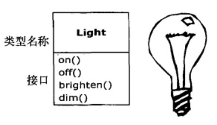

# 对象导论 #

>我们之所以将自然界分解，组织成各种概念，并按其含义分类，主要是因为我们是整个口语交流社会共同遵守的协定的参与者，这个协定以语言的形式固定下来......除非赞成这个协定中规定的有关语言信息的组织和分类，否则我们根本无法交谈——Benjamin Lee Whorf 人类学家，语言学家

## 抽象过程 ##

汇编，C等语言所作的主要抽象仍要求在解决问题时要**基于计算机的结构**，而不是**基于所要解决的问题的结构**来考虑的。

**程序员的作用**——

程序员必须建立起在**机器模型**(位于**解空间**内，这是对问题建模的地方，例如计算机) 和 **实际待解决问题的模型**(位于**问题空间**内，这是存在的地方，例如一项业务)之间的关联。

建立这种映射是费力的，而且这不属于编程语言所固有的功能，这使程序难以编写，并且维护代价高昂，同时也产生了作为副产物的整个**编程行业**

---

面向对象方式将**问题空间**中的元素及其在**解空间**的表示称为**对象**。

这种思想的**实质**是：**程序可以通过添加新类型的对象使自身适用于某个特定的方法**。

当你在阅读描述解决方案的代码的同时，也是在阅读问题的表述。相比以前我们所使用的编程语言，这是一种更灵活，更强有力的**抽象**。

所以，OOP允许根据问题来描述问题，而不是根据运行解决方案的计算机来描述问题。

---

Alay Kay总结5个OOP的基本特性：

1. 万物皆为对象。

2. 程序是对象的集合，它们通过发送消息来告知彼此所要做的。

3. 每个对象都有自己的由其他对象所构成的存储。（**组合**）

4. 每个对象都拥有其类型——每个对象都是某个类class的一个实例instance。

5. 某一特定类型的所有对象都可以接受同样的消息。 （**多态**）

Grady Booch 对 对象提出了一个更加简洁的描述：**对象具有状态、行为和标识**

## 每个对象都有一个接口 ##

面向对象程序设计的挑战之一，就是在**问题空间的元素和解空间的对象之间创建一对一的映射**。

怎样才能获得有用的对象呢？必须有某种方式产生对**对象请求**，使对象完成各种任务，如完成一笔交易、在屏幕上画图、打开开关等等。

每个对象都只能满足某些请求，这些请求由对象的接口interface所定义，决定接口的便是类型。

**接口**确定了对某一特定对象所能发出的**请求**。在程序中必须有满足这些请求的代码。这些代码与隐藏的数据一起构成**实现**。

在类型中，每一个可能的请求都有一个方法与之相关联，当向对象“发送消息”产生请求时，与之相关联的方法就会被调用。

此过程通常被概括为：向某个对象“发送消息”(产生请求)，这个对象便知道此消息的目的，然后执行对应程序代码。

## 每个对象都提供服务 ##

当正在试图开发或理解一个程序设计时，最好的方法之一就是将对象想象为**服务提供者**。程序本身将向用户提供服务，它将通过调用其他对象提供的服务来实现这一目的。**你的目的就是去创建（或者最好是在现有代码库中寻找）能够提供理想的服务来解决问题的一系列对象**。

1. 着手从事这件事的一种方式就是问自己：“**若我可以将问题从表现中抽取出来，那么什么样的对象可以马上解决我的问题**？”

2. 在编程过程当中，哪些对象已经存在，哪些对象不存在，它们看起来是怎样的？它们能够提供哪些服务它们需要哪些对象才能履行它们的义务？如果持续这样做，那么最终你会说“**那个对象看起来很简单，可以做下来写代码了**”，或者说“我肯定那个对象已经存在”。**这是将问题分解为对象集合一种合理的方法**。

将对象看作是服务提供者还有一个附带的好处：有助于提高对象的内聚性。

**高内聚**是软件设计的基本质量要求之一：这意味着一个软件构件（例如一个对象，当然它也有可能是指一个方法或一个对象库）的各个方面“组合”得很好。

**在良好的OOP中，每个对象都可以很好地完成一项任务，但是它并不视图做更多的事**。

## 被隐藏的具体实现 ##

