# IO #

[File类](#File类)

[输入和输出](#输入和输出)

[RandomAccessFile](#RandomAccessFile)

[IO流的典型使用方式](#IO流的典型使用方式)

[文件读写的实用工具](#文件读写的实用工具)

[标准IO](#标准IO)

[进程控制](#进程控制)

[新IO](#新IO)

[压缩](#压缩)

[对象序列化](#对象序列化)

[XML](#XML)

[Preferences](#Preferences)

## File类 ##

The **File** class has a deceiving name; you might think it refers to a file, but it doesn't. In fact, "FilePath" would have been a better name for the class. It can be represent the name of particular file or the name of a set of files in a directory.

### 目录列出器 ###

[DirList](DirList.java) FilenameFilter 及 new File().list() 的运用 （涉及到策略模式）

[DirList2](DirList2.java)

[DirList3](DirList3.java) **DirList** 使用匿名类方式实现的两个例子

### 目录实用工具 ###

程序设计中一项常见的任务就是在文件集上执行操作，这些文件要么在本地目录中，要么遍布整个目录树中。

[Directory](../util/Directory.java) 一种工具为你产生基于你提供的正则表达式而被选中的文件集

[PPrint](../util/PPrint.java) 一个可以打印时添加新行并缩排所有元素的工具

[DirectoryDemo](DirectoryDemo.java) Directory的运用示例

[ProcessFiles](../util/ProcessFiles.java) 用到策略模式，执行了查找具有特定扩展名的文件所需的全部工作，并且当它找到匹配的文件时，将直接把文件传递给Strategy对象，（打算用这些文件干什么东东）（这策略模式写得太纠缠了）

### 目录的检查及创建 ###

File类不仅仅只代表存在的文件或目录。也可以用File对象来创建的目录或尚不存在的整个目录路径。可以查看文件的特性（如：大小，最后修改时间，读/写），检查某个File对象代表的是一个文件还是一个目录，并可删除文件。

[MakeDirectories](MakeDirectories.java) File类的一些其他方法

## 输入和输出 ##

InputStream或Reader 的read()，读取单个字节或者字节数组

OutputStream或Writer的write()，写单个字节或者字节数组

### InputStream ###

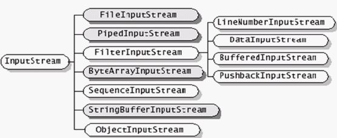

### OutputStream ###

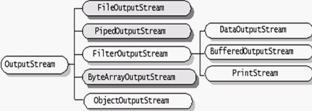

### Reader ####

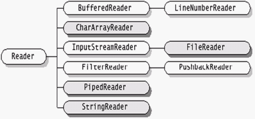

### Writer ###

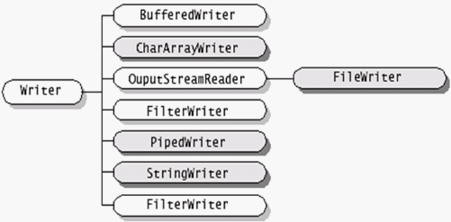

InputStream和OutputStream在以面向**字节**形式的IO中仍可以提供极有价值的功能，Reader和Writer则提供兼容Unicode与面向**字符**IO功能

### 数据的来源和去处 ###

InputStream 与 Reader 关系

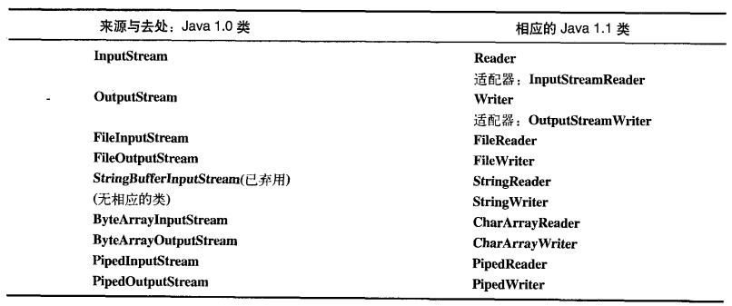

### 更改流行为 ###

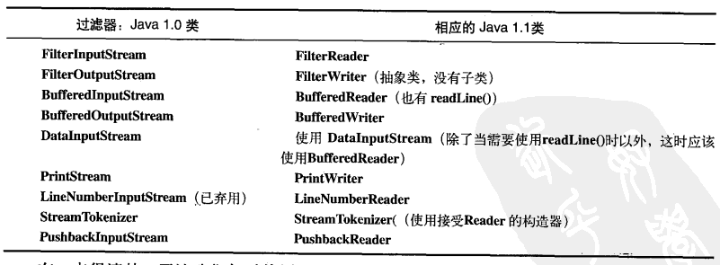

### 未发生变化的类 ###

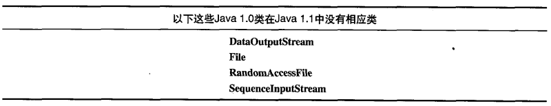

## RandomAccessFile ##

适用于由大小已知的记录组成的文件，所以可以使用**seek()**将记录从一处转移到另一处，然后读取或者修改记录。

在JDK 1.4 中，RandomAccessFile的大多数功能（但不是全部）由nio存储映射文件所取代。

## IO流的典型使用方式 ##

### 缓冲输入文件 ###

[BufferedInputFile](BufferedInputFile.java)

### 从内存输入 ###

[MemoryInput](MemoryInput.java)

### 格式化的内存输入 ###

[FormattedMemoryInput](FormattedMemoryInput.java) 一个字节一个字节地读取

[TestEOF](TestEOF.java) 使用available()方法查看还有多少可供存取的字符，然后，一次一个字节地读取文件

注意，available()的工作方式会随着所读取的媒介类型的不同而有所不同；字面意思就是“在没有阻塞的情况下所能读取的字节数”。对于文件，这意味着整个文件；但是对于不同类型的流，可能就不是这样，因此要谨慎使用。

### 基本的文件输出 ###

FileWriter对象可以先文件写入数据

[BasicFileOutput](BasicFileOutput.java)

LineNumberInputStream没卵用

**文本文件输出的快捷方式**

Java SE5在PrintWriter中添加了一个辅助构造器，使得你**不必**在每次希望创建文本并向其中写入时，都去执行所有的装饰工作。

[FileOutputShortcut](FileOutputShortcut.java)

### 存储和恢复数据 ###

[StoringAndRecoveringData](StoringAndRecoveringData.java)DataOutputStream 和 DataInputStream 存取或读取基本类型

### 读取随机访问文件 ###

利用**seek()**可以到处移动

[UsingRandomAccessFile](UsingRandomAccessFile.java)

### 管道流 ###

PipedInputStream

PipedOutStream

PipedReader

PipedWriter

用在多线程问题上

## 文件读写的实用工具 ##

一个很常见的程序化任务就是读取文件到内存，修改，然后再写出。Java I/O类库的问题之一就是：它需要编写相当多的代码去执行这些常用操作——没有基本的帮助功能可以为我们做一切。所以编写一个工具用来简化对文件读写操作。

[TextFile](../util/TextFile.java) 一个工具用来简化对文件读写操作

另一种解决读取文件问题的方法是使用在Java SE5中引入的java.util.Scaner类。但是这能读不能写，主要是设计用来创建编程语言的扫描器或“小语言”

### 读取二进制文件 ###

[BinaryFile](../util/BinaryFile.java)

.class 文件都是以十六进制字符“CAFEBABE”

## 标准IO ##

System.in

System.out

System.err

### 从标准输入中读取 ###

[Echo](Echo.java)

### 将System.out转换成PrintWriter ###

[ChangeSystemOut](ChangeSystemOut.java)

### 标准IO重定向 ###

System.setIn(InputStream)

System.setOut(PrintStream)

System.setErr(PrintStream)

[Redirecting](Redirecting.java)

## 进程控制 ##

在Java内部执行其他操作系统的程序，并且要控制这些程序的输入和输出。

[OSExecute](../util/OSExecute.java)

[OSExecuteDemo](../util/OSExecuteDemo.java)

## 新IO ##

JDK 1.4的java.nio.* 包中引入了新的Java IO类库，其目的在于提高速度。实际上，旧的IO包已经使用nio重新实现，以便充分利用这种速度提高，因此，即使我们不显示地用nio编写大妈，也能从中受益。 

速度的提高来自于所使用的结构更接近操作系统IO方式：

**通道和缓冲器**。

我们可以把它想象成一个煤矿，通常是一个包含煤层（数据）的矿藏，而缓冲器则是派送到矿藏的卡车。

卡车载满煤炭而归，再从卡车上获得煤炭。也就是说，我们并没有直接和通道交互;我们只是和缓冲器交互，并把缓冲器派送到通道。

通道要么从缓冲器获得数据，要么向缓冲器发送数据。

唯一直接与通道交互的缓冲器是ByteBuffer，也就是说，可以存储未加工字节的缓冲器。

**FileInputStream**,**FileOutputStream**,即读又写得**RandomAccessFile**。注意这些字节操纵流，与低层的nio性质一致。

**Reader**和**Writer**这种字符模式类不能用于产生通道；但是java.nio.channels.Channels类提供了实用方法

[GetChannel](GetChannel.java) 用Channel向文件写入字符串并且之后读取这字符串

[ChannelCopy](ChannelCopy.java) 用FileChannel实现简单的文件复制

[TransferTo](TransferTo.java) FileChannel的transferTo()/transferFrom实现简单的文件复制

### 转换数据 ###

[BufferToText](BufferToText.java) ByteBuffer 转换成 CharBuffer，过程需要 编码问题

[AvailableCharSets](AvailableCharSets.java) java.nio.charset.Charset类提供把数据编码成多种不同类型的字符集

### 获取基本类型 ###

尽管ByteBuffer只能保存字节类型的数据，但是它具有可以从其所容纳的字节中产生出各种不同基本类型值的方法

[GetData](GetData.java) 插入和抽取各种数值

### 视图缓冲器 ###

View Buffer可以让我们通过某个特定的基本数据类型的视窗查看其底层的ByteBuffer。ByteBuffer依然是实际存储数据的地方，“支持”着前面的尸体，因此，对视图的任何修改都会映射成为对ByteBuffer中数据的修改。

[IntBufferDemo](IntBufferDemo.java)

一旦底层的ByteBuffer通过视图缓冲器填满了证书或其他基本类型是，就可以直接被写到通道中了。正像从通道中读取那样容易，然后使用视图缓冲器可以把任何数据都转换成某一特定的基本类型。

[ViewBuffers](ViewBuffers.java) 通过在不同的视图缓冲器，将同一个字节序列翻译成short、int、float、long、double类型数据

ByteBuffer通过一个被“包装”过的8字节数组产生，然后通过各种不同的基本类型的视图缓冲器显示了出来。

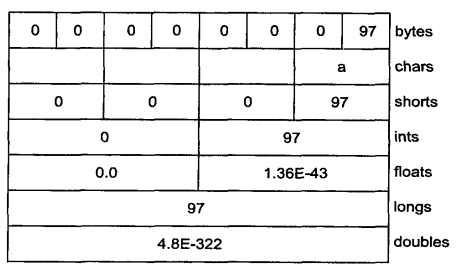

### 字节存放次序 ###

不同的机器可能会使用不同的字节排序方法来存储数据。

**Big endian 高位优先**将最重要的字节存放在地址最低的存储器单元

**Little endian 低位优先**将最重要的字节放在地址最高的存储器单元

	字符a = 97 = 00000000 01100001
				 高位     低位
	
	地址默认是 从左到右 增大

	---
	
	助记

	数的高位 放置 低地址是 大端（高低得大）
	数的低位 放置 低地址是 小端（低低得小）

	大端常用（因为符合阅读习惯）

ByteBuffer是以**高位优先**的形式存储数据的，并且网上传送时也常常使用高位优先的形式。

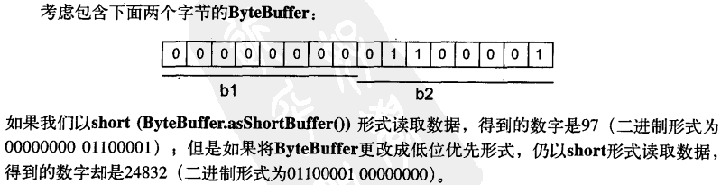

[Endians](Endians.java) 可以修字符中的字节次序

### 用缓冲器操纵数据 ###

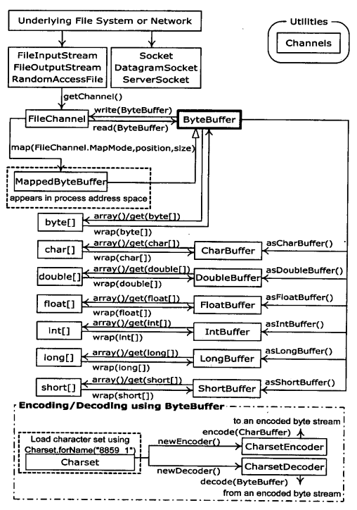

上图阐明nio类之间的关系，便于立即怎么移动和转换数据。例如，如果想把一个字节数组写到文件中去，那么就应该使用ByteBuffer.wrap把字节数组包装起来，然后用getChannel()在FileOutputStream上打开一个通道，接着将来置于ByteBuffer的数据写到FileChannel中

**注意**：ByteBuffer是将数据移进移出通道的为方式，并且我们**只能**创建一个dulde基本类型缓冲器，或者使用“as”方法从ByteBuffer中获取。也就是说，**我们不能把基本类型的缓冲器转换成ByteBuffer**。然而，由于我们可以经由视图缓冲器将基本类型数据移进移出ByteBuffer，所有这就不是什么真正的限制。

### 缓冲器的细节 ###

Buffer由数据和可以高效地访问及操纵这些数据的四个索引组成，这四个索引是：mark标记、position位置、limit界限和capacity容量

下面用于设置和复位索引以及查询它们的值的方法

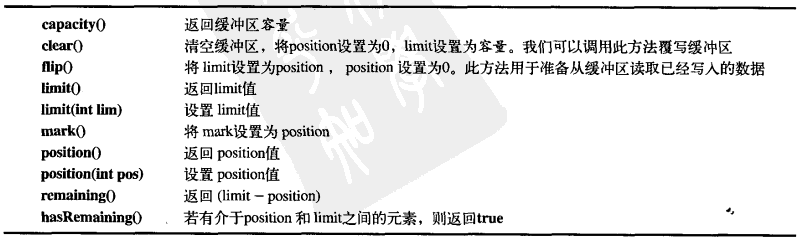

[UsingBuffers](UsingBuffers.java) 交换相邻字符

下面是上例的symmetricScramble()流程解释图

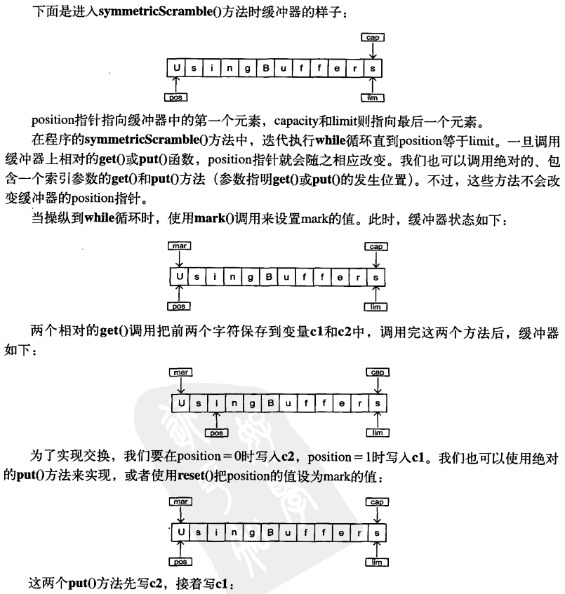

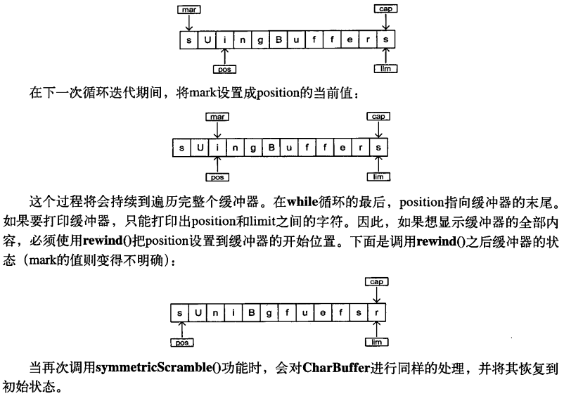

### 内存映射文件 ###

内存映射文件允许我们创建和修改那些因为太大而不能放入内存的文件。

有了内存映射文件，我们就可以假定整个文件都放在内存中，而且可以完全把它当做非常大的数组来访问。

[LargeMappedFiles](LargeMappedFiles.java)

[MappedIO](MappedIO.java) 性能上进行简单的测试，看出**映射文件放**往往可以更加显著地加快速度

### 文件加锁 ###

JDK 1.4 引入了文件加锁机制，它允许我们同步访问某个作为共享资源的文件。

竞争同一文件的两个线程可能在不同的Java虚拟机上；或者一个Java线程，另一个是操作系统中其他的某个本地线程。

文件锁对其他的操作系统进程是可见的，因为Java的文件加锁字节映射到了本地操作系统的加锁工具。

[FileLocking](FileLocking.java)

[LockingMappedFiles](LockingMappedFiles.java) 对映射文件的部分加锁

## 压缩 ##

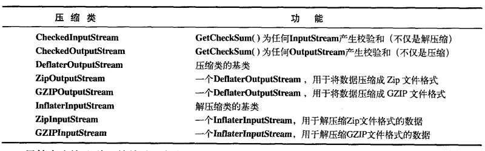

[GZIPcompress](GZIPcompress.java) 对单个文件进行压缩的例子

[ZipCompress](ZipCompress.java) 对Zip进行多文件保存，Checksum类来计算和校验和的方法

### Java档案文件（Jar） ###

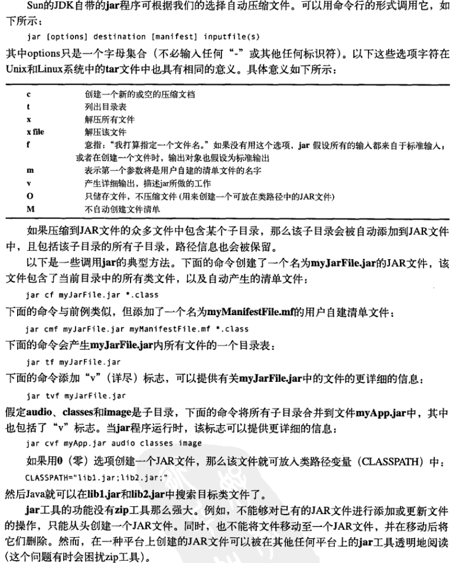

## 对象序列化 ##

Java的**对象序列化**将那些实现了Serializable接口的对象转换成一个字节序列，并能够在以后将这个字节序列完全恢复为原来的对象。

这一个过程甚至可通过网络进行，这意味着序列化机制自动弥补不同操作系统之间的差异。也就是说，可以在运行Windows系统的计算机上创建一个对象，将其序列化，通过网络将它发给一台运行Unix系统的计算机，然后在那里准确地重新组装，而却不必担心数据在不同机器上的表示会不同，也不必关心字节的顺序或者其他任何细节。

对象序列化的概念加入到语言中为了支持两种特性：

1. Java的**远程方法调用**Remote Method Invocation，它使存活与其他计算机上的对象使用起来就像是活在本机上一样。当向远程对象发送消息时，通过对象序列化来传输参数和返回值。

2. 对于JavaBeans来说，对象的序列化也是必需的。使用一个Bean时，一般情况下是在设计阶段对它的状态信息进行配置。这种状态信息必须保存下来，并在程序启动时进行后期恢复，这种具体工作就是由对象序列化完成的。

[Worm](Worm.java)

### 寻找类 ###

**问题**：将一个对象从它的序列化状态中恢复出来，有哪些工作是必须的呢？举例来说，假如我们将一个对象序列化，并通过网络将其作为文件传给另一台计算机；那么，另一台计算机上的程序可以只利用该文件内容来还原这个对象。

[Alien](Alien.java)

[FreezeAlien](FreezeAlien.java)

[ThawAlien](xfiles/ThawAlien.java) 该示例说明上问题是可以的，当要确保Alien,class要在Java虚拟机上出现，否则ClassNotFoundException

### 序列化的控制 ###

**问题**：默认的序列化机制并不难操纵。然而，如果有特殊的需要那又该怎么办呢？例如：

1. 也许要考虑特殊的安全问题，而且你不希望对象的某一部分被序列化
2. 或者一个对象被还原以后，某对象需要重新创建，从而不必将该子对象序列化

解决方案：通过实现**Externalizable**接口代替**Serializable**.

**Externalizable**增添writeExternal()和readExternal()

[Blips](Blips.java)

对于Serializable对象，对象完全以它存储的二进制位为基础构造，而不调用构造器。

对于Externalizable对象，所有普通的默认构造器都会被调用（包括在字段定义时的初始化），然后调用readExternal()。

**必须注意这一点**——所有默认的构造器都会被调用，才能使Externalize对象产生正确的行为。

[Blip3](Blip3.java) 示范了如何完整保存和恢复一个Externalizable对象

### transient(瞬时)关键字 ###

如果我们正在操作的是一个Serializable对象，那么所有序列化操作都会自动进行。为了能够给予控制，可以用**transient**(瞬时)关键字逐个字段地关闭序列化，它的意思是“**不用麻烦你保存或恢复数据——我自己会处理**”

[Logon](Logon.java)

### Externalizable的替代方法 ###

实现Serializable接口，必须具有准确的方法特征签名

	private void writeObject(ObjectOutputStream stream) throws IOException {
	}

	private void readObject(ObjectInputStream stream) throws IOException, ClassNotFoundException {
	}

实际上我们并没有从这个类的其他方法中调用它们，而是ObjectOutputStream和ObjectInputStream对象的writeObject()和readObject()方法调用你的对象的writeObject()和readObject()方法。

疑问：ObjectOutputStream和ObjectInputStream对象怎样访问你的类中的private方法的。我们只能假设这正是序列化神奇的一部分（反射）

[SerialCtl](SerialCtl.java) 

### 使用“持久性” ###

一个比较诱人的使用序列化技术的想法是：存储程序的一些状态，以便我们随后可以很容易地将程序恢复到当前状态。

但是在我们能够这样做之前，必须回答几个问题：

1. 如果我们将两个对象——它们都具有第三个对象的引用——进行序列化，会发生什么情况？

2. 当我们从它们的序列化状态恢复这两个对象时，第三个对象会只出现一次吗？

3. 如果将这两个对象序列化成独立的文件，然后在代码的不同部分对它们进行反序列还原，又会怎样了？

[MyWorld](MyWorld.java) 解释上面的问题

只要将任何对象序列化到单一流中，就可以恢复出与我们写出时的对象网，并且没有任何意外重复复制出的对象。

[StoreCADState](StoreCADState.java) 模拟CAD系统实现序列化

[RecoverCADState](RecoverCADState.java) 恢复上例的存储的序列化的数据

序列化静态字段，需要用静态方法参考 **RecoverCADState** 的Line的静态方法

## XML ##

	<dependency>
	    <groupId>xom</groupId>
	    <artifactId>xom</artifactId>
	    <version>1.2.5</version>
	</dependency>

[Person](xml/Person.java)

[People](xml/People.java)

## Preferences ##

Preferences API用于存储和读取用户的偏好(preferences)以及程序配置项的设置

只能用这玩意存储基本类型和字符串，并且每个字符串的存储长度不能超过8K

[PreferencesDemo](PreferencesDemo.java)