# String #

[不可变String](#不可变string)

[重载+与StringBuilder](#重载+与stringbuilder)

[无意识的递归](#无意识的递归)

[String上的操作](#string上的操作)

[格式化输出](#格式化输出)

[正则表达式](#正则表达式)

[扫描输入](#扫描输入)

[StringTokenizer](#stringtokenizer)

## 不可变String ##

String对象是不可改变的。查看JDK文档你就会发现，String类中每一个看起来会修改String值的方法，实际上都是创建了一个全新的String对象，以包含字符串内容。而最初的String丝毫未动。

[Immutable](Immutable.java)

## 重载+与StringBuilder ##

不可改变带来一定效率问题。为String对象重载的+操作符就是一个例子。重载的意思是，一个操作符在应用于特定的类时，被赋予特殊的意义（用于String的 + 与 += 是Java仅有的两个重载过的操作符，而Java并不允许程序员重载任何操作符）

[Concatenation](Concatenation.java)

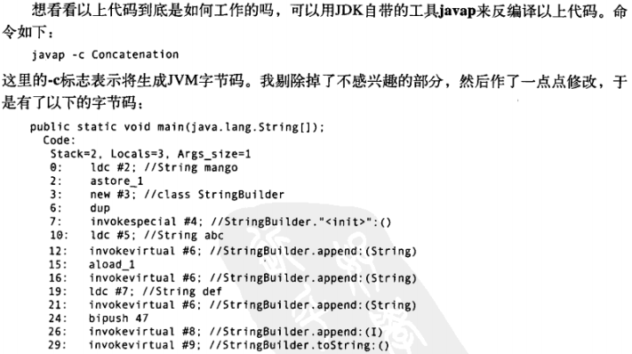
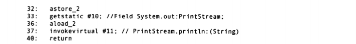

反汇编后需注意的是：编译器自动引入java.lang.StringBuilder类。虽然在源码中未使用StringBuilder，但是编译器却自作主张使用它，因为它高效。

随意用String，编译器会为你优化？

[WhitherStringBuilder](WhitherStringBuilder.java) 反汇编后看看for循环内 拼接String对象与StringBuilder的对比

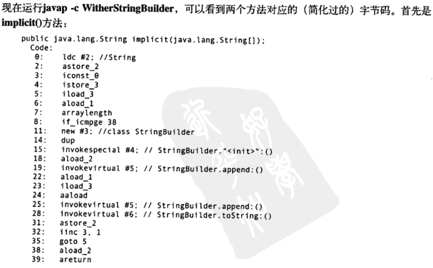

注意重点是：StringBuilder是在循环内构造，这意味着每经过循环一次，就会创建一个新的StringBuilder对象。

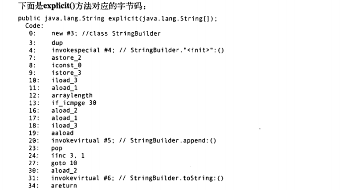

可以看到，不仅循环部分简短，而且它只生成了一个StringBuilder对象。显示地创建StringBuilder还允许你预先为其指定大小。若你已知最终字符串大概有多长，那预先指定StringBuilder的大小可以避免多次重新分配缓冲。

[UsingStringBuilder](UsingStringBuilder.java) 若需要在toString()方法中使用循环，最好创建一个StringBuilder对象，用它来构造最终的结果。

## 无意识的递归 ##

[ArrayListDisplay](ArrayListDisplay.java) ArrayList.toString()，他会遍历ArrayList中包含的所有对象，调用每个元素上的toString()方法

若你希望toString()方法打印对象的内存地址，也许你会考虑使用this关键字：

[InfiniteRecursion](InfiniteRecursion.java)

会得到

	Exception in thread "main" java.lang.StackOverflowError

原因在于

	public String toString() {
	    return " InfiniteRecursion address: " + this + "\n";
	 }

this前面是字符串，+ 重载为字符串的拼接符，于是this就调用toString()，于是发生递归调用

解决方法：将this换成super.toString()

## String上的操作 ##

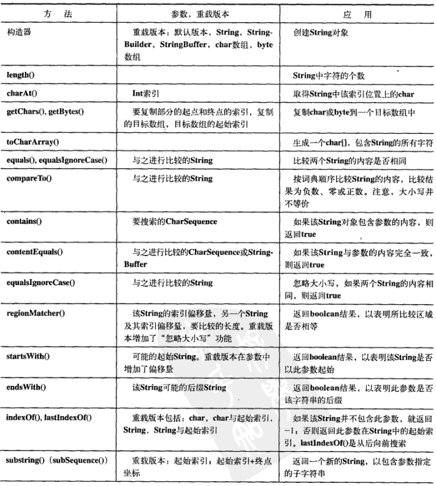
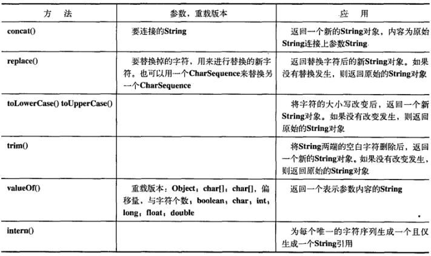

## 格式化输出 ##

Java SE5推出C语言中printf()风格的格式化输出这一功能，它简单，强大。

### printf() ###

C语言中printf()

	printf("%d %f", x, y);

%d %f **格式修饰符**

x %d 整型

y %f 浮点型

### System.out.format() ###

Java SE5引入的format方法可用于PrintStream或PrintWriter对象

format()方法模仿自C的printf()

[SimpleFormat](SimpleFormat.java)

### Formatter ###

可以将Formatter看作一个翻译器，它将你的格式化字符串与数据翻译成需要的结果。

[Turtle](Turtle.java)

Formatter的构造器经过重载可以接受多种输出目的地，最常用的是PrintStream()、OutputStream和File

### 格式化说明符 ###

语法

	%[argument_index$][flags][width][.precision]conversion

	%-10.2f

最常见的应用是控制一个域的最小尺寸，这可以通过制定width来实现。Formatter对象通过必要时添加空格，来确保一个域至少达到某个长度。在默认的情况下，数据是右对齐，不过可以通过使用“-”标志来改变对齐方向。

与width相对的precision，它来自指明最大尺寸。

width可应用于各种类型的数据转换，并且其行为方式都一样。

precision则不然。

1. precision用于String时，它表示打印String时输出字符的最大数量。
2. precision用于浮点数，它表示小数部分要显示出来的位数(默认是6位小数)，若小数位数过多则舍入，太少则尾部补零。
3. 由于整数没有小数部分，precision无法用于整型，否则会触发异常

### Formatter转化 ###

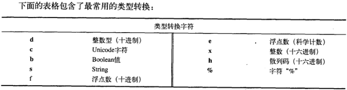

[Conversion](Conversion.java)

程序中的每个变量都用到b转换。虽然它对各种类型都是合法的，但其行为却不一定与你想象的一致。

对于boolean基本类型或Boolean对象，其转换结果对应的true或false。

但是，对其他类型的参数，只要该参数不为null，那转换结果永为true.

即使是数字0，转换结果依然为true，而在其他语言中（包括C）,往往转换为false。所以，将b应用于非布尔类型的对象时请格外小心。

### String.format() ###

Java SE5参考了C中的sprintf()方法，以生成格式化的String对象。

String.format()是一个static方法，它接受与Formatter.format()方法一样的参数，但返回一个String对象。但**返回一个String对象**。

[DatabaseException](DatabaseException.java)

### 一个十六进制转储(dump)工具 ###

[Hex](../util/Hex.java) 将文件打印成Hex

## 正则表达式 ##

### 基础 ###

	\d 一位数字
	
	\\在Java中意思是“我要插入一个正则表达式的反斜线，所以其后的字符具有特殊意义”。
	
	-?\\d+表示“可能有一个负号，后面跟着一位或多位数字”

---

应用正则表达式的最简单的途径，就是利用String类内建功能

	"".matches(String regex)

[IntegerMatch](IntegerMatch.java)

---

String类还自带一个非常有用的正则表达式工具——**split()**方法，其功能是“将字符串从正则表达式匹配的地方切开。”

	"".split(String regex)

[Splitting](Splitting.java)

---

一个替换工具
	
	"".replaceFirst(String regex, String replacement)
	"".replaceAll(String regex, String replacement)

[Replacing](Replacing.java)

### 创建正则表达式 ###

了解更多请参考JDK文档java.util.regex包中的Pattern类

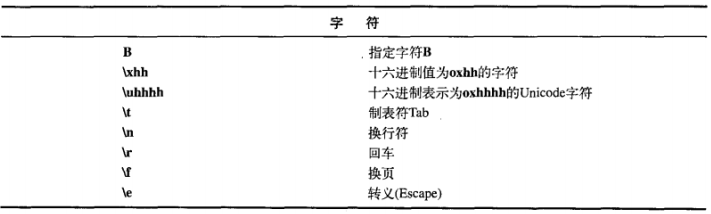
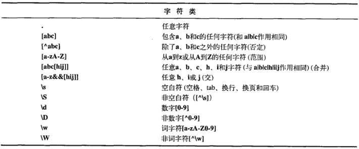
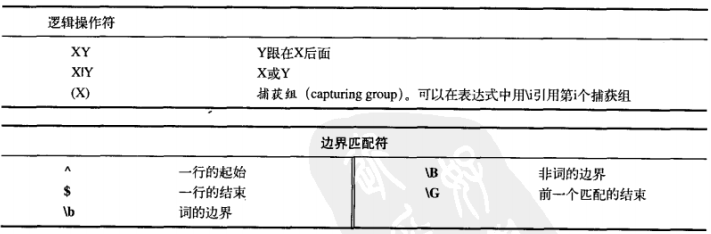

[Rudolph](Rudolph.java)

### 量词 ###

量词描述了一个模式吸收输入文本的方式：

- 贪婪型：量词总是贪婪的，除非有其他的选项被设置。**贪婪表达式会为所有可能的模式发现尽可能多的匹配**。导致此问题的一个典型理由就是假定我们的模式仅能匹配第一个可能的字符组，如果它是贪婪的，那么它就会继续往下匹配。

- 勉强型：用问号来指定，**这个量词匹配满足模式所需的最少字符数**。因此也称作懒惰的、最少匹配的、非贪婪的、或不贪婪的、

- 占有型：目前，这种类型的量词只有在Java语言中才可用，并且也更高级，因此我们不会立刻用到它。当正则表达式被应用于字符串时，它会产生相当多的状态，以便在匹配失败时，可以回溯。而“占有的”量词并不保存这些中间状态，因此他们可以防止回溯。**它们常常用于防止正则表达式失控**，因而让正则表达式执行更有效。

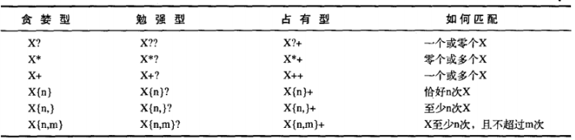

### Pattern和Matcher ###

比起功能有限的String类，更愿意构造功能强大的正则表达式对象。

只需导入java.util.regex，然后用static Pattern.compile()方法来编译你的正则表达式即可。

基本套路

    Pattern p = Pattern.compile(regex);
    Matcher m = p.matcher(string);

    while(m.find()) {
        System.out.println("Match \"" + m.group() + "\" at positions " +
          m.start() + "-" + (m.end() - 1));
    }

[TestRegularExpression](TestRegularExpression.java) 测试正则表达式，看看它们能否匹配一个输入字符串

Pattern提供的

	static boolean matches(String regex, CharSequence input)

该方法用以检查regex是否匹配整个CharSequence类型的input参数。

---

[Finding](Finding.java)

Matcher.find()方法可用来在CharSequence中查找多个匹配。

find()像迭代器那样前向遍历输入字符串。

---

**组Groups**

组是用括号划分的正则表达式，可以根据组的编号来引用某个组。

组号为0表示整个表达式，组号1表示被第一对括号括起的组，以此类推。

	A(B(C))D

中有三个组：组0是**ABCD**，组1是**BC**，组2是**C**

	public int groupCount()
返回该匹配器的模式中的分组数目，第0组不包括在内。

	public String group()
返回前一次匹配操作(例如find())的第0组(整个匹配)

	public String group(int group) 
返回前一次匹配操作期间指定的组号，若匹配成功，但是指定的组没有匹配输入字符串的任何部分，则将返回null。

	public int start(int group)
返回在前一次匹配操作中寻找到的组的起始索引。

	public int end(int group)
返回在第一次匹配操作中寻找到的组的最后一个字符索引加一的值。

[Groups](Groups.java)

[StartEnd](StartEnd.java) start()、end()、matches()和lookingAt()用法

### Pattern标记 ###

Pattern类的compile()方法还有另一版本，它接受一个标记参数，以调整匹配行为：

	public static Pattern compile(String regex, int flags)

其中flag来自以下Pattern类中的常量：

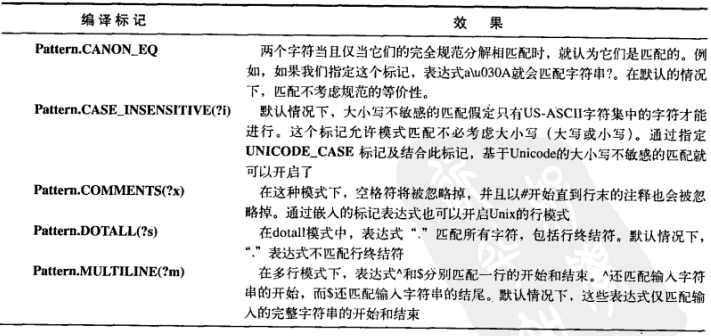
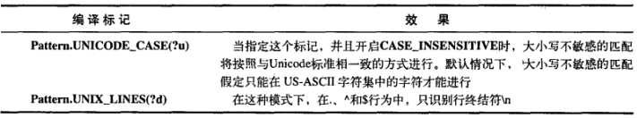

可通过 或 “|”操作符组合多个标记的功能

[ReFlags](ReFlags.java)

### split() ###

split()方法将输入字符串断开成字符串对象数组

	public String[] split(CharSequence input)
	
	public String[] split(CharSequence input, int limit)

第二种形式的split()方法可以限制将输入分割成字符串的数量。

[SplitDemo](SplitDemo.java)

### 替换操作 ###

	"".replaceFirst(String regex, String replacement)
	"".replaceAll(String regex, String replacement)
上面有描述

	Matcher.appendReplacement(StringBuffer sb, String replacement)
执行渐进式的替换

[TheReplacements](TheReplacements.java) 把文章中的元音符改为大写

### reset() ###

reset()可以将现有的Matcher对象应用于一个新的字符序列：

[Resetting](Resetting.java)

无参的reset()方法，可以将Matcher对象重新设置到当前字符序列的起始位置。

### 正则表达式与Java IO ###

[JGrep](JGrep.java) 输入两个参数：文件名以及要匹配的正则表达式。输出的是有匹配的部分以及部分在行中的位置。灵感源于Unix的grep

## 扫描输入 ##

到目前为止，从文件或标准输入读取数据还是一件相当痛苦的事情。

一般解决之道就是读入一行文本，对其进行分词，然后使用Integer、Double类各种解析方法来解析数据。

[SimpleRead](SimpleRead.java)

太麻烦了

Java SE5新增了Scanner类，它可以大大减轻扫描输入的工作负担

[BetterRead](BetterRead.java)

### Scanner定界符 ###

默认情况下，Scanner根据空白字符对输入进行分词，但是你可以用正则表达式指定自己所需的定界符：

[ScannerDelimiter](ScannerDelimiter.java)

### 用正则表达式扫描 ###

除了能够扫描基本类型之外，你还可以使用**自定义的正则表达式**进行扫描，这是扫描复杂数据的时候非常有用。

[ThreatAnalyzer](ThreatAnalyzer.java)

## StringTokenizer ##

在Java引入正则表达式（J2SE1.4）和Scanner类（Java SE5）之前，分割字符串的唯一方法是使用StringTokenizer来分词。

[ReplacingStringTokenizer](ReplacingStringTokenizer.java) 使用正则表达式或Scanner对象，我们能够以更加复杂的模式来分割一个字符串，而对于StringToken来说是十分困难的。

基本上，可以放心的说，StringTokenizer已经可以废弃不用了。

