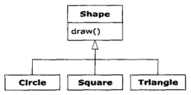

# 类型信息 #

运行时类型信息Runtime Type Information RTTI 使得你可以在程序运行时发现的使用类型信息

## 为什么需要RTTI ##

OOP基本目的是：让代码只操纵对基类(这里是Shape)的引用。这样，如果要添加一个新类(比如从Shape派生的Rhomboid)来扩展程序，就不会影响原来的代码。

该例Shape接口动态绑定draw()，目的是让客户端程序员使用泛化Shape引用来调用draw()。

draw()在所有派生类里都会被覆盖，并且由于它是被**动态绑定**的，所以即使是通过泛化Shape引用来调用，也能产生正确行为。这就是**多态**。

[Shapes](Shapes.java)

示例中取出元素时，这种——实际上它将所有的事物都当作Object持有——会自动将结果转型会Shape。

这是RTTI最基本的使用形式，因为在Java中，**所有的类型转换都是在运行时进行正确性检查**。

这也是RTTI的含义：在运行时，识别一个对象的类型。

在这个例子中，**RTTI类型转换并不彻底**：Object被转换成Shape，而不是Circle等。

这是因为目前只知道List<Shape>保存的都是Shape。在编译时，将由容器和Java的泛型系统来强制确保这一点；而在运行时，由类型转换操作来确保这一点。

接下来就是**多态机制**的事情了，Shape对象实际执行什么样的代码，是由引用所指向的具体对象Cricle而决定。

使用RTTI可查询Shape引用所指向对象确切类型。

